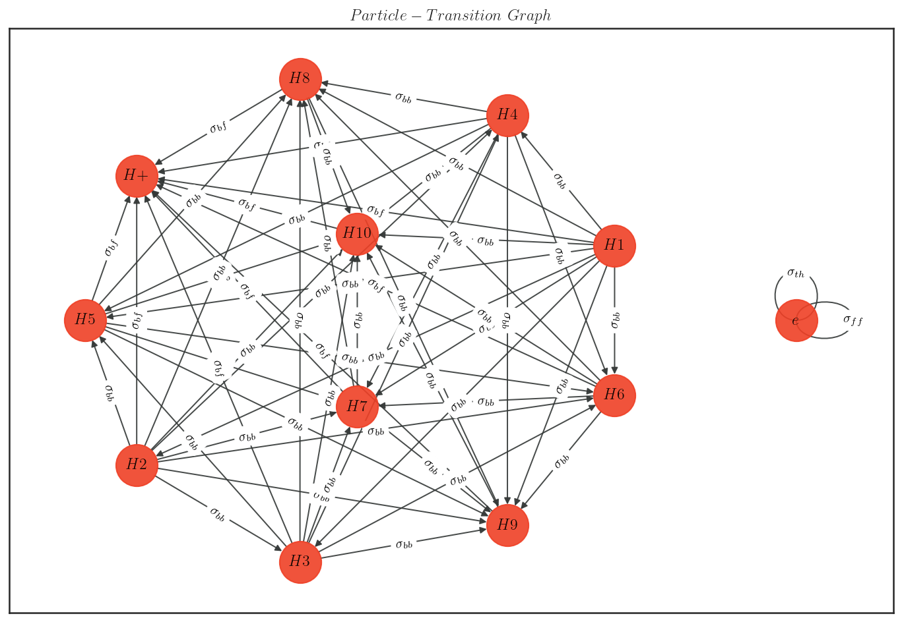
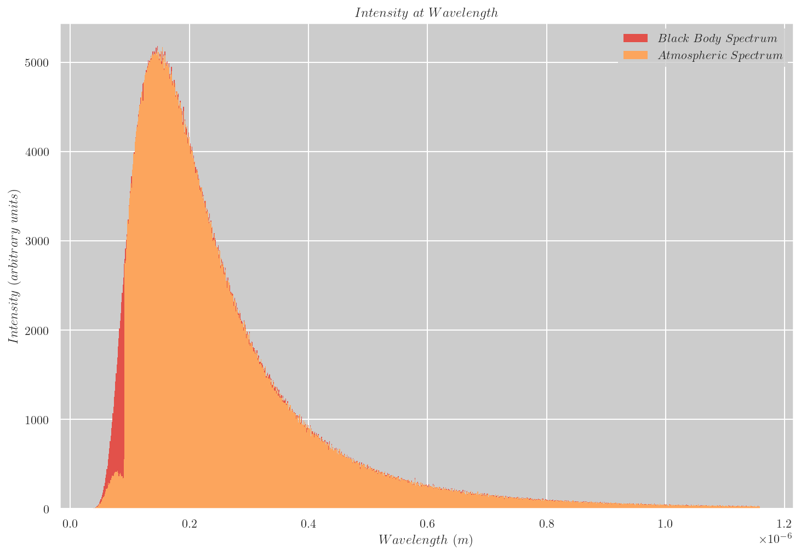
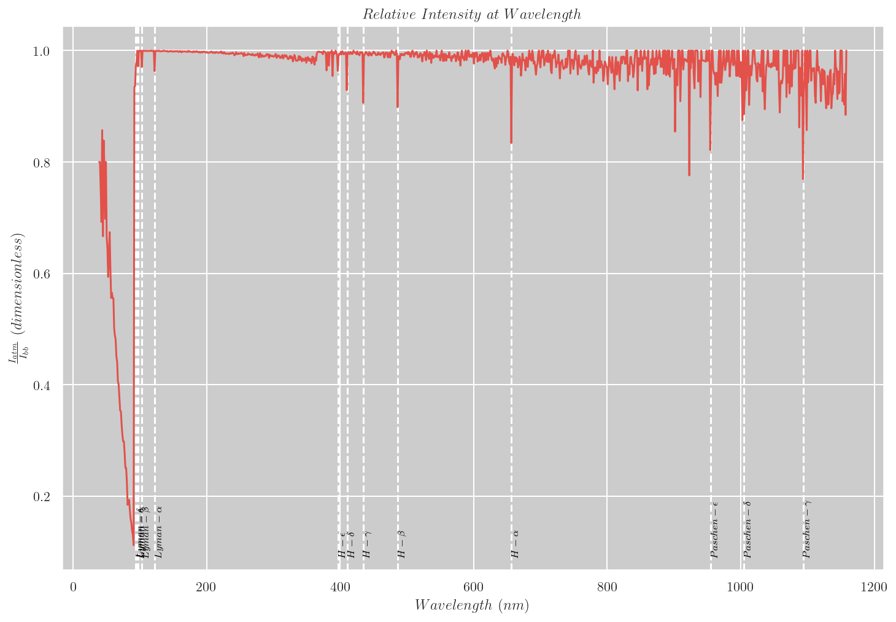
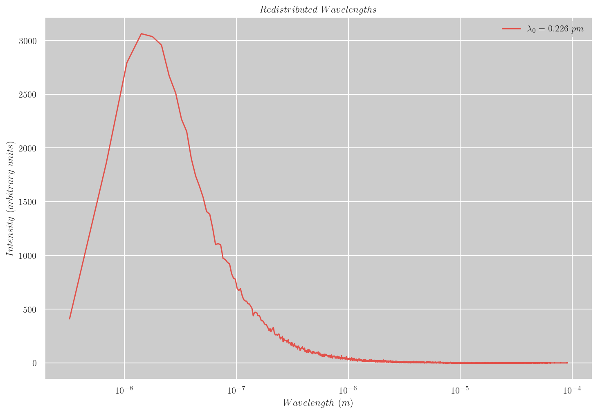
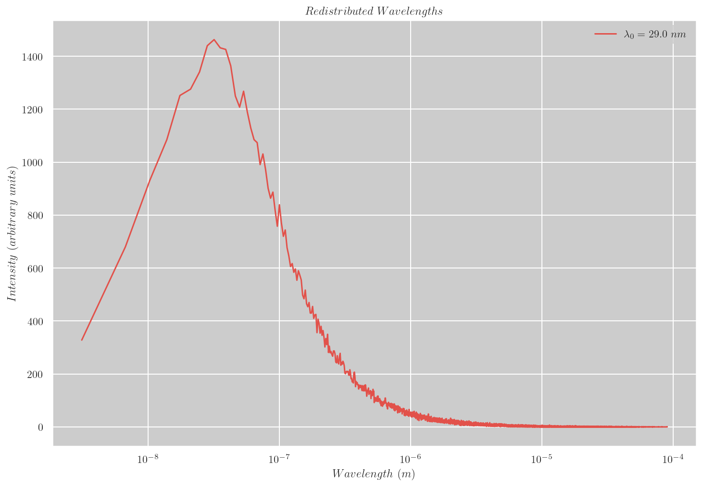

# Table of Contents

- [Development](#development)
  - [Setting up your Workspace](#setting-up-your-workspace)
  - [Running the Programs](#running-the-programs)
- [Physics of Spectral Synthesis](#physics-of-spectral-synthesis)
  - [Photon Source](#photon-source)
  - [Atmosphere](#atmosphere)
  - [Particle-Photon Interactions](#particle-photon-interactions)
  - [Simulation](#simulation)
  - [Results](#results)
- [Physics of Frequency Redistribution](#physics-of-frequency-redistribution)
  - [1D Random Walk Simulation](#1d-random-walk-simulation)
  - [Simulation Results](#simulation-results)
- [References](#references)

# Development

## Setting up your Workspace

To setup your workspace, create an Anaconda environment using:

```
conda env create --file environment.yml
```

This sets up an environment `ph285-project` and installs dependencies under `$CONDA_PREFIX/ph285-project`.

To update the environment following changes to `environment.yml` run:

```
conda env update --file environment.yml
```

Alternatively, environment can be specified at a desired location using the `--prefix` option.
However, this overrides the `name` parameter in `environment.yml`.
To update an environment created this way, the `--prefix` option must always be specified.

## Running the Programs

To run spectral synthesis and frequency redistribution programs you'll need run configurations.
Run configurations used in the examples are known to converge on particle density numbers.
If you are supplying your own run configuration files, their names are required to follow the format -
`[PREFIX]-config.json`. With the run configuration setup, programs can be run by specifying the prefix
with `-p` or `--prefix` options. Both programs output their results to disk so that analysis code can be
rerun without having to repeat the simulation every time.

### Examples

#### Spectral Synthesis

1. Create a run config file `[PREFIX]-config.json` with contents like so (edit based on your chosen parameters):

```json
    {
        "geometry": {
            "type": "spherical",
            "source_span": 0.66,
            "grid_size": 0.03
        },
        "source": {
            "temperature": 20000,
            "photons": 100000
        },
        "atmosphere": {
            "thickness": 0.33,
            "core_density": 1e22,
            "surface_density": 1e20,
            "density_gradient": "exponential",
            "core_temperature": 20000,
            "surface_temperature": 10000,
            "temperature_gradient": "exponential"
        }
    }
```

2. Ensure your Anaconda environment is activated using `conda activate` or `conda active [/path/to/conda-prefix]`

3. Run the program (replace `[PREFIX]` with the prefix you provided in filename):

```sh
    python3 spectral_synthesis.py -p [PREFIX]
```

#### Frequency Redistribution

1. Create a run config file `[PREFIX]-config.json` with contents like so (edit based on your chosen parameters):

```json
    {
        "density": 1e30,
        "temperature": 1e6,
        "thickness": 5,
        "test_wavelength": 2.26e-13,
        "re_emit": true,
        "photons": 100000,
        "steps": 100000,
        "checkpoints": [100, 1000, 10000]
    }
```

2. Ensure your Anaconda environment is activated using `conda activate` or `conda active [/path/to/conda-prefix]`

3. Run the program (replace `[PREFIX]` with the prefix you provided in filename):

```sh
    python3 frequency_redistribution.py -p [PREFIX]
```

#### Skip-Simulation and Visualisation Modes

Both programs can be run with `-x` flag to skip the simulation and only run the analysis code.
Additionally, spectral synthesis code can be run with `-v` flag to visualise the photon-particle
interaction processes that are modelled and geometry of the atmosphere used
(i.e. positions of the grid cells relative to the photon source and atmosphere).


# Physics of Spectral Synthesis

Ability to reproduce observed spectra of stars and interstellar gas is important in astrophysical modelling
to understand the composition of astrophysical objects. One such example is Pacucci et al. (2026)[^1],
in which the authors use synthetic spectra to argue that little red dots found in James Webb Space Telescope (JWST)
images maybe direct collapse black holes.

We demonstrate this ability with our simplified model comprising three components:
1. Source: A source of photons; we implemented a Black Body source following Planck's law.
2. Atmosphere: Matter particles that interact with photons and the state they are in; given some starting particle density, elemental composition and temperature our model estimates which particles there are and in what numbers and where they are in the atmosphere using Saha ionisation and Boltzmann equations.
3. Particle-Photon Interactions: Physical processes involving photon and matter interactions and probabilities of their occurrance.

## Photon Source

This is the simplest component in our model. We implemented a Black Body radiation source which given a temperature produces wavelengths following Planck's law.

$$ B(\lambda, T) = \frac{2 h c}{\lambda^{3}} \frac{1}{e^{\frac{h c}{\lambda k_{B} T}} - 1} $$

In a star, photons originate as nuclear photons from nuclear fusion. These are Gamma wavelength photons that do not
follow Planck's law. However, the process of frequency redistribution due to Compton scattering and Doppler shifts during
collisions with high energy electrons and free-free absorption and re-emission as we will discuss later,
result in these photons being converted to thermal photons making our choice of source appropriate.

### Implementation

There are a few different ways to generate random numbers following a given distribution using only pseudorandom numbers that a computer can generate approximately following uniform distribution. Inverse Transform Sampling is an efficient approach where a random number sampled from uniform distribution is transformed using the inverse function of target cumulative distribution function (CDF). Calculating the CDF of Planck's function for spectral radiance and inverting it is analytically intractable. An alternative approach is rejection sampling - where random numbers are sampled from uniform distribution and accepted or rejected depending on whether they agree with the function being modelled.

For example, for a target function $f(x)$, rejection sampling is described by the following Python-style pseudocode:

```python
while True:
    x = uniform_random(x_min, x_max)
    y_guessed = uniform_random(f_min, f_max)
    if y_guessed <= f(x):
        return x
```

Implementing rejection sampling requires defining a bounding box within which to sample wavelengths and correspoding spectral radiance guesses.
A simple bounding box can be defined by taking wavelength range where most of the energy is distributed and use the maximum value of spectral radiance predicted at wavelength given by Wien's displacement law ($\lambda_{max} = \frac{2.897 \times 10^{-3}}{T} $) as upper bound of radiance guesses. For wavelength bounds, we use wavelengths from $0.1$ to $8$ times the wavelength at maximum spectral radiance given by Wien's displacement law which constitute $99\%$ of energy radiated from a Black Body.

This approach has a maximum efficiency given by area under the curve of target function (i.e. Planck's function for radiance) divided by area of the bounding box. Approximating the Planck's curve to be a triangle this results in a maximum of $50\%$ efficiency i.e. half of wavelengths generated are rejected. In reality, spectral radiance curve rises sharply and has a long tail. This results in a much smaller area under curve and measured efficiency of $20\%$. However, the bounding box can be split into smaller regions and photons can be generated within the bounds of these smaller boxes proportional to area of the box. Further, an excess of photons can be generated in each box with an excess of $\frac{1}{efficiency}$. By having sufficiently large number of smaller bounding boxes we improve efficiency per box and overall efficiency to near $100\%$ requiring no excess photons to be generated.

The bounding boxes approach is not suitable for generating very small number of photons as a number of photons proportional to bounding box area need to be generated to provide the final sample. In frequency redistribution simulation we require smaller samples to simulate re-emissions after free-free absorption. To address this we sample a large number ($1M$) photons at the start of the simulation and resample a small number with replacement as required. Since the originally sampled photons agree with Planck's law, resampled photons too agree with Planck's distribution.

## Atmosphere

Stellar atmospheres are complex. A number of physical processes affect the composition, densities and temperatures
in various regions of a star. We overlook these processes and implement a simplified model of stellar atmosphere.
Our atmosphere is defined using the following parameters: geometry, thickness, elemental composition, density and temperature gradients and their boundary conditions.

### Geometry

We implemented two choices of geometry:
1. Planar: Approximates plane parallel atmosphere where we are looking at a small section of atmosphere of a star with large radius of curvature making it appear like a cubic volume. The angle at which a photon is travelling has no effect on the number of interactions it has in our 1D simulation.
2. Spherical: Atmosphere of a spherical star where angle at which a photon travels affects the number of interactions it has with matter. In particular, the photon has to travel longer in colder atmosphere when travelling at a larger angle with respect to a photon travelling radially outward. This results in _limb darkening_ effect where a star appears dimmer when looking towards the outer edges of the star.

The following diagrams show spherical geometry, atmosphere grids a photon would encounter as it travels through the atmosphere
at the two extremes of angles and resulting drop in relative intensity ($\frac{I_{atmosphere}(\lambda)}{I_{source}(\lambda)}$) with increasing angle of travel.

| Geometry | Limb Darkening |
| - | - |
|  |  |

### Thickness

In our implementation atmospheric thickness is specified using grid size in arbitrary units.
Since our implementation is a stopped random walk with fixed step size and Monte-Carlo integration variable is physical distance,
it is only accurate if the grid size is significantly shorter than photon's mean free path: $l_{\lambda} = \frac{1}{\alpha_{\lambda}}$, where $\alpha_{\lambda}$ is the opacity experienced by the photon. Considering Thomson scattering (the only process modelled that affects continuum opacity as opposed to specific wavelengths) and a temperature of $20000 K$, mean free path length $\approx 2 km$. If we consider the grids to be $1 m$ ($<< 2 km$) thick so that a photon can safely make it across to the next grid, a grid size of $0.003 units$ would mean atmospheric thickness of $0.33 units$ is $110 m$ thick. Therefore, we need to be careful in specifying the density and temperature gradients when modelling realistic atmospheres.

### Composition and Gradients

Our implementation only handles Hydrogenic species i.e. particles with $0$ or $1$ electrons. Given a Particle-Transition graph (discussed in next section) and an elemental composition - fractions of elemental species such as $H$, $He$, etc. where the fraction is a sum of all variants of that species i.e. ions such as $H^{+}$ and excitation states such as ground state - $H_{I}$, first excited state - $H_{II}$, etc and for a total particle number density $(n) m^{-3}$ and temperature $T K$ calculated using the gradients, we estimate the number densities of individual particles using Saha ionisation equation and Boltzmann equation.

Saha ionisation equation (reproduced from Carroll and Ostlie (2018)[^2]) is:

$$ \frac{n_{i+1}}{n_{i}} = \frac{2 Z_{i+1}}{n_{e} Z{i}}  \left( \frac{2 \pi m_{e} k_{B} T}{h^{2}} \right)^{\frac{3}{2}} e^{-\frac{\chi_{i}}{k_{B} T}} $$

where $n_{i}$ are the number densities of $i^{th}$ ionisation state, $\chi_{i}$ are the corresponding ionisation energies, $n_{e}$ is the electron number density and $Z_{i}$ are the partition functions of $i^{th}$ ion.

Partition functions are a measure of contribution of a species of particle to total energy of system of particles. For example, if most of the Hydrogen atoms are in higher excited states the overall energy required to ionise the Hydrogen-only atmosphere is lower and therefore $n_{1}$ would be significantly higher than $n_{0}$. Partition functions are given by:

$$ Z =  \sum_{j = 1}^{\infty}{g_{j} e^{−\frac{E_{j} − E_{0}}{k_{B} T}}} $$

where $g_{j}$ are degeneracies of $j^{th}$ excitation state and $E_{j}$ are corresponding energies. For a hydrogen atom in $j^{th}$ excitation state, degeneracy is $2 j^{2}$.

Additionally, we have the following constraints as $i^{th}$ ionisation state adds $i$ electrons to the atmosphere and total number density of an elemental species has to match the fraction specified in elemental composition:

$$ n_{e} = \sum_{i, j}{j n_{j}}$$

$$ n f_{i} = \sum_{j} n_{j} $$

where $i$ correspond to an element (e.g. $H$, $He$, etc.) and $j$ correspond to an ion of that element. $n$ is the total number density of all particles in the atmosphere and $f_{i}$ is the fraction of an elemental species.

This gives us a system of equations that can be solved for electron number density and number densities of ions of each element.

Once we establish ion number densities, we calculate the number densities of individual excitation states using Boltzmann equation:

$$ \frac{n_{i}}{n_{1}} = \frac{g_{i}}{g_{1}} e^{−\frac{E_{i} − E_{1}}{k_{B} T}} $$

where $n_{i}$ are number densities of $i^{th}$ excitation state and $g_{i}$, $E_{i}$ are corresponding degeneracies and energies.

To solve the Saha and Boltzmann equations we need to know the temperature and total number densities. We obtain these by dividing the atmosphere into equally spaced grids and integrating the provided gradient function with boundary conditions to obtain the values in each grid cell.

## Particle-Photon Interactions

In our implementation a photon can interact with a particle in four possible ways:

### Bound-Bound Absorption

This is when a photon is absorbed by an electron bound to a nucleus and moves into a higher excited state. This occurs at specific wavelengths ($\lambda_{0} = \frac{E_{j} - E_{i}}{h c}$) corresponding to the jump which results in the characteristic absorption spectrum of the star revealing its composition. However, jumps between energy states do not occur all the time and photons may be re-emitted immediately following stimulated emission process. Oscillator strength gives a measure of such probability. These are fairly complex to estimate and involve quantum mechanical correction factors (i.e. Gaunt factors) that are harder to estimate. We use pre-calculated values from Menzel and Pekeris (1935)[^3] and use their approximation to calculate values for missing transitions. Additionally, the uncertainty principle and thermal motion of particles contributes to broadening of wavelength range at which Bound-Bound absorption occurs which is modelled using a line profile function $\phi(\lambda)$. In our implementation, we ignore the effect due to uncertainty principle and model the thermal motion of particles resulting in broadening that follows Gaussian distribution. We then define cross section - an analogue for cross sectional area of interaction between photon and a single particle - using the following equation modified from Shields et al. (2025)[^4] to work with S.I. units:

$$ \sigma_{bb}(\lambda) = \frac{e^2}{4 \epsilon_{0} m_e c} f_{l, u}  \left( 1 − \frac{g_l n_u}{g_u n_l} \right) \phi(\lambda) $$

where $n_l$ and $n_u$ are the number densities of lower and higher excitation states of a particle, $f_{l, u}$ the corresponding oscillator strength and $g$ are degeneracies of each state.

The line profile function is simply the Gaussian distribution probability density function centered on $\lambda_{0}$ with doppler width calculated using mean particle velocity from Maxwell-Boltzmann distribution as:

$$ w = \frac{1}{\lambda_{0}} \sqrt{\frac{k_B T}{Z m_p}} $$

where $Z$ is the nuclear charge of the element (i.e. atomic number).

### Bound-Free Absorption

This is the photoionisation process where a photon is absorbed by an electron bound to a nucleus and is ejected from the nuclear potential well. Any photon with sufficient energy (equal to ionisation energy) is able to cause ionisation, therefore we expect to see a continuous drop in intensities at shorter wavelengths provided there are sufficient unionised species of an element in the atmosphere.

Bound-Free cross section modified for S.I. units is given by:

$$ \sigma_{bf}(\lambda) = \frac{16 \pi^3 Z^4 e^{10} m_e}{3 \sqrt{3} \epsilon_{0} c^{4} h^6}  \frac{\lambda^{3}}{n^5} g_{bf} $$

where $n$ is the excitation state (principal quantum number) of the interacting particle and $g_{bf}$ is the quantum mechanical correction factor.

### Free-Free Absorption

This is a process in which a free electron in the Coloumb potential well of a nearby ion absorbs a photon and decelerates. The opposite of this process is when an electron accelerates in the potential well and emits a photon. Free-Free absorption (and emission) process has a smaller cross section compared to other processes described here. However, it can play a significant role in electron rich environments and the emission process in particular increases the rate at which nuclear photons are thermalised resulting in the Black Body approximation we used for our source function.

Free-Free corss section modified for S.I. units is given by:

$$ \sigma_{ff}(\lambda) =  \frac{\sqrt{2} Z^2 e^6 \lambda^3}{3 \sqrt{3 \pi} \epsilon_{0} c^4 h (k_B m_e^3 T)^\frac{1}{2}}  g_{ff} $$

### Scattering

Scattering is a process in which a photon collides with a particle and changes direction. Unlike free-free absorption process, photon is not absorbed in a scattering process. There are several scattering processes that come into play depending on the wavelengths and temperature and density regimes. We implemented Thomson scattering which is wavelength independent and dominant form of scattering in the regime we are simulating (soft UV, visible and near-infrared wavelengths and temperature around $20000 K$). We also implemented Compton scattering separately to demonstrate the frequency redistribution process in a separate simulation described in later sections.

Thomson scattering cross section is the simplest of cross sections to calculate - it has a fixed value of $6.65 \times 10^{-29} m^{-2}$.

### Implementation

We take an object oriented approach to defining a `Particle` and a `Transition` to another particle upon interaction with a photon. Specific processes such as Bound-Bound and Free-Free interactions are subclasses of `Transition` base class and provide methods to calculate wavelength dependent cross section. Opacity from a transition is simply calculated as product of number density of source particle of a transition and the calculated cross section ($\alpha_{i,tr}(\lambda) = n_{i} \sigma_{i,tr}(\lambda)$).

Following is a snippet of code from spectral synthesis code showing how bound-bound transitions are defined between various excitation states of Hydrogen atom, bound-free between these states to Hydrogen ion and free-free and scattering transitions from an electron to itself.

```python
electron = Particle('e', 0, 1, -1)
particles = set()
transitions = set([
    ThomsonScattering(electron, electron),
    FreeFreeAbsorption(electron, electron)
])

hydrogen_excitations = [Particle(f'H{i}', 1, i, 0) for i in range(1, 11)]
hydrogen_ion = Particle('H+', 1, 1, 1)

for particle in itertools.chain(hydrogen_excitations, [hydrogen_ion]):
    particles.add(particle)

for i in range(len(hydrogen_excitations) - 1):
    for j in range(i + 1, len(hydrogen_excitations)):
        transitions.add(BoundBoundAbsorption(hydrogen_excitations[i],
                                             hydrogen_excitations[j],
                                             oscillator_strength[i, j]))
for excitation in hydrogen_excitations:
    transitions.add(BoundFreeAbsorption(excitation, hydrogen_ion))
```

This snippet of code generates a transition graph that looks as follow:



While using object oriented programming makes our code easy to read, it makes it less flexible to integrate with just-in-time compliers such as [Numba](https://numba.pydata.org).

## Simulation

We implemented a 1D stopped random walk rather than a true 1D random walk where a photon moves in fixed steps in a single direction (i.e. from outer edge of source on the left to outer edge of the atmosphere) with a chance of stopping the walk when absorbed. Photos that escape the atmosphere are collected to chart the atmospheric spectrum. The simulation effectively performs a Monte-Carlo integration with physical length as the integration variable to calculate the output intensities at each wavelength given the source intensities at these wavelengths.

$$ I_{\lambda} = S_{\lambda} \left( 1 - \int_{r_{i}}^{r_{f}}{\alpha_{\lambda}(r) d r} \right) $$

Aside: Monte-Carlo integration is a process by which integral of a function $f(x)$ can be calculated by writing the function as product of another function $g(x)$ and a valid probability density function $h(x)$. So the integral $\int_{x_i}^{x_f}{f(x) dx} = \int_{x_i}^{x_f}{g(x) h(x) dx}$ which is the expected value of $g(x)$ in the integration range. This can be calculated by sampling a large number of random variables from $h(x)$ and calculating $g(x)$ at corresponding points. For a complex function such as the opacity function $\alpha_{\lambda}(r)$ calculating the integral analytically is intractable. However, Monte-Carlo integration makes the calculation numerically feasible.

The choice of stopped random walk with fixed steps allowed us to reduce the integration to fewer sequential steps:
1. Calculate opacity matrix for a large number of photons at every grid point of the simulation all at once
2. Compare the opacity matrix with a matrix of uniformly sampled random variables to check if an absorption has occurred ($X(r, \lambda) < \alpha(r, \lambda)$) in any step for any photon
3. Add up the number of surviving photons at each wavelength to obtain the spectrum

Additionally, the opacity matrix is computed for smaller chunks of photons in parallel to reduce the simulation time.

However, the choice of fixed step is only valid when grids are closer than mean free path length. This places limitations on atmosphere thickness and gradients simulated (see the discussion under [Thickness](#thickness)). Frequency redistribution due to scattering and re-emission processes are also omitted from this simulation. A separate implementation of frequency redistribution is provided which demonstrates the process by simulating Compton scattering and Doppler shifting at shorter wavelengths.

## Results

Besides demonstration of _limb darkening_ effect discussed under [Geometry](#geometry), our simulation produced the following spectra - the spectrum for source demonstrates the wavelength generation function working and agreeing with Planck's law and the atmospheric spectrum shows absorption from the modelled processes. The Hydrogen spectral lines are more noticable in the relative intensity chart which computes the ratio of output and source intensities. We also notice significant drop in intensity in UV wavelength range due to bound-free absorption ionising the Hydrogen atoms.

While this demonstrates the general features of Hydrogen gas spectrum, the intensity values are not accurate as the re-emission and frequency redistribution processes haven't been modelled.

| Black Body and Atmospheric Spectra | Relative Intensities and Hydrogen Spectral Lines |
| - | - |
|  |  |

Conditions on atmospheric thickness and gradients can also be removed by moving to a ray tracing approach to sample and integrate over optical depth rather than physical distance similar to [STARDIS](https://tardis-sn.github.io/stardis) codes.

# Physics of Frequency Redistribution

Primary photon generation process in a star is nucleosynthesis. This does not follow Planck's law. Photons generated in Hydrogen burning process of nuclear fusion are in Gamma wavelengths. For example, capture of a proton by Deuterium in PP I chain produces $5.49 MeV$ photons. However, the light we see is in UV, visible and infrared range. This is a result of combination of processes altering the wavelengths of gamma photons. For example, as photons climb through the Graviational potential well they lose energy and are redshifted. However, majority of frequency redistribution happens due photon-particle interactions and in particular photon-electron interactions. Core of a star is a fairly complex environment with excess of electron density due to high levels of ionisation and nuclear electrons (i.e. beta emissions). Our simulation models a simpler environment with free electrons due to ionised Hydrogen gas and frequency redistribution due to Compton scattering and Doppler shifting processes. We also include re-emissions following free-free absorptions to demonstrate thermalisation of nuclear photons and gradual shift to Black Body approximation in higher layers of stellar atmosphere. Note that free-free cross section at Gamma wavelengths is insignificant and doesn't contribute to the results shown here. However, it becomes more significant as wavelengths are shifted to soft-UV range. This gradual shifting is shown in the frequency redistribution examples notebook.

##  1D Random Walk Simulation

We implemented a true 1D random walk where a photon can move in either left or right direction and has a chance of being absorbed due to free-free interaction. Where an absorption occurs it is immediately re-emitted as a thermal photon in a random direction due to free-free emission following Planck's law. However, the re-emission process can be turned off by specifying the flag in run configuration file (see the examples notebook) which demonstrates frequency redistribution due to scattering processes alone. In this case the photon is treated as lost (similar to the spectral synthesis code).

Monte-Carlo integration variable is changed to optical depth ($\tau$) rather than physical distance ($r$) so that the photon is moved to point of interaction on each simulation step. Since the steps are run sequentially this prevents wasted cycles where photon doesn't interact with any particle. Unlike the spectral synthesis code there are no advantages to using fixed step size in this simulation. Optical depth is sampled from exponential distribution ($P(\tau) = e^{- \tau}$) and is related to physical distance as $ \tau_{\lambda} = \alpha_{\lambda} r $.

As a further simplification the atmosphere simulated has zero density and temperature gradient which reduces the number of opacity calculations to one calculation per photon rather than calculation per photon per position vector of the photon. In 1D, Compton scatter process is also simplified as scatter angle can either be $0$ or $\pi$ i.e. Compton scatter did not occur (photon is still scattered by Thomson scattering without a change in its momentum) or the photon is inelastically reflected with its wavelength shifting by twice that of Compton wavelength ($4.85 pm$). Doppler shift is applied on top of Compton shifted wavelength by sampling electron velocity from Gaussian distribution approximating Maxwell-Boltzmann distribution. In reality direction of travel of electron relative to photon affects the scatter angle. We omit that detail here - scatter at $0$ or $\pi$ have the same probabilities.

Photons are started off at a left boundary and are allowed to escape out of the right boundary. To prevent photons from escaping out into the source at left boundary we implement a mirror at the left edge which reflects the photon back into the atmosphere. This reduces the expected number of steps for a photon to escape to $\frac{\tau^2}{2}$. Considering only Thomson scattering opacity (same for Compton scattering), the mean number of steps to escape measured in our simulation matches the theoretical value. There is a minor variance due to small number of free-free interactions and stochastic nature of simulation.

## Simulation Results

Our simulation for $5.4 MeV$ photons travelling through fully ionised Hydrogen gas at $1M K$ and particle density of $10^{30} m^{-3}$ we observe the photons being shifted to X-ray wavelengths mainly as a result of Compton scattering. As expected there is a minor but insignificant redistribution from thermalisation by free-free processes. Simulation at UV wavelengths (see the examples notebook) show increase in thermalisation although still insignificant compared to Doppler shifting. Compton scattering is also less significant at this wavelength range ($4.85 pm$ being $< 0.01\%$ of $29 nm$) and shifting can be attributed to Doppler effect on collisions with high energy electrons at $1M K$ moving at maximum speed of $0.01\%$ speed of light.

| Gamma Redistribution | UV Redistribution |
| - | - |
|  |  |

Further simulations in higher wavelength ranges are required to show the role of thermalisation processes and support approximating the inner atmospheric layers as a Black Body.

# References

[^1]: Pacucci, F., Ferrara, A., & Kocevski, D. D. 2026 (arXiv), http://arxiv.org/abs/2601.14368

[^2]: Carroll, B. W., & Ostlie, D. A. 2018, An introduction to modern astrophysics (Second edition; Cambridge: Cambridge University Press)

[^3]: Menzel, D. H., & Pekeris, C. L. 1935, Monthly Notices of the Royal Astronomical Society, 96 (OUP), p. 77-110

[^4]: Shields, J. V., Kerzendorf, W., Smith, I. G., et al. 2025 (arXiv), http://arxiv.org/abs/2504.17762
