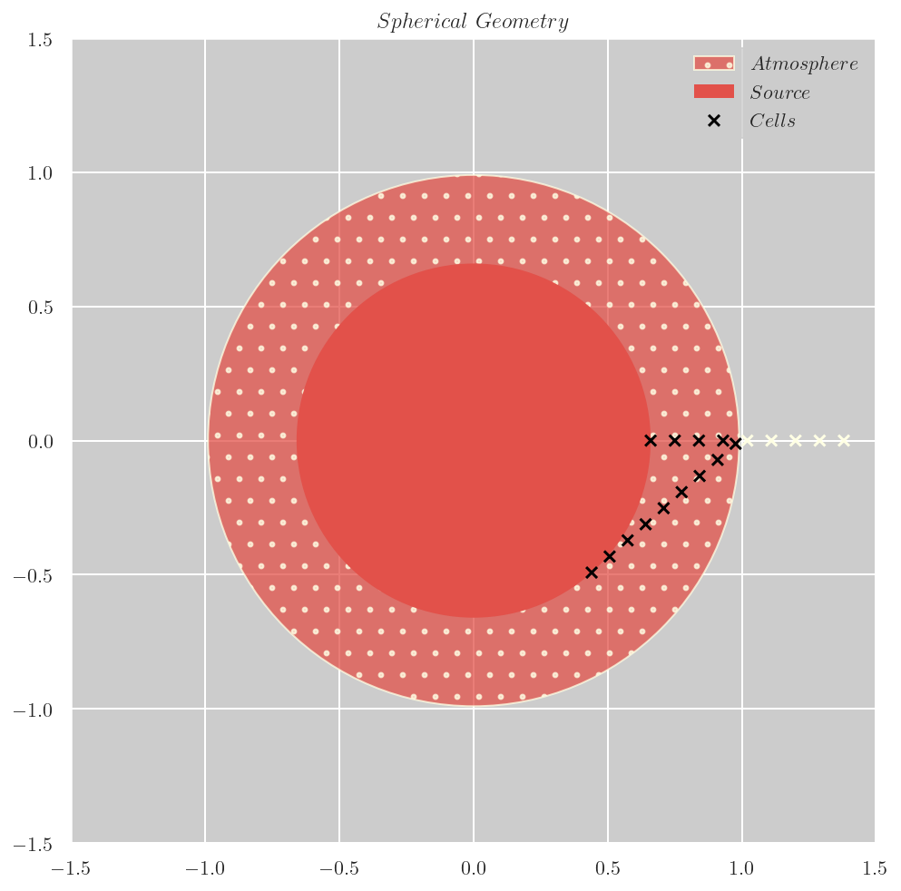
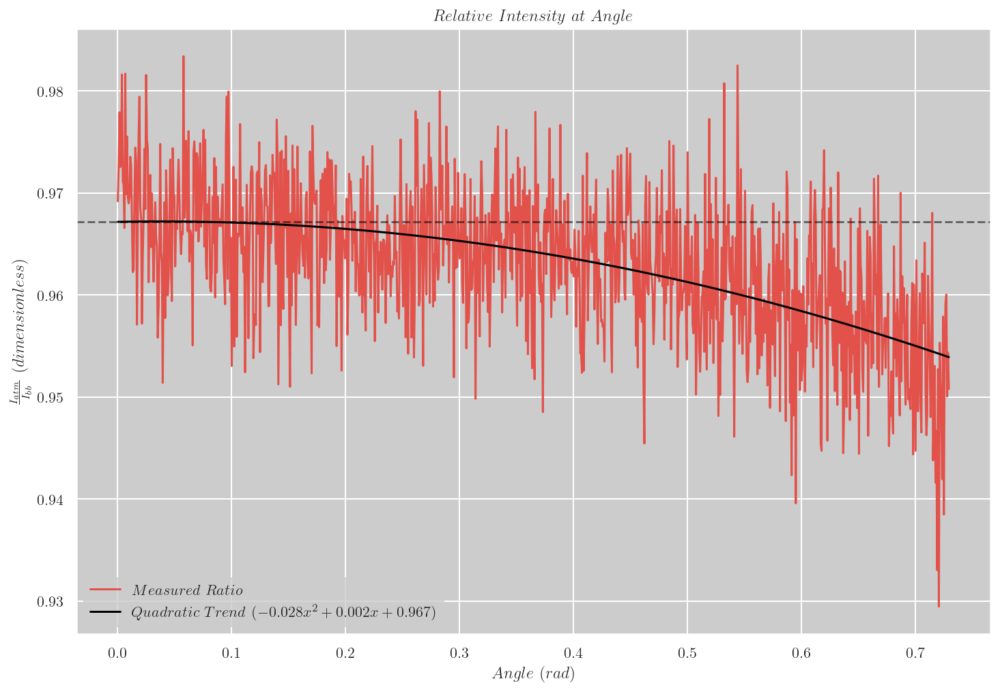

# Development

## Setting up your workspace

To setup your workspace, create an Anaconda environment using:

```
conda env create --file environment.yml
```

This sets up an environment `ph285-project` and installs dependencies under `$CONDA_PREFIX/ph285-project`.

To update the environment following changes to `environment.yml` run:

```
conda env update --file environment.yml
```

Alternatively, environment can be specified at a desired location using the `--prefix` option.
However, this overrides the `name` parameter in `environment.yml`.
To update an environment created this way, the `--prefix` option must always be specified.

## Running the programs

To run spectral synthesis and frequency redistribution programs you'll need run configurations.
Run configurations used in the examples are known to converge on particle density numbers.
If you are supplying your own run configuration files, their names are required to follow the format -
`[PREFIX]-config.json`. With the run configuration setup, programs can be run by specifying the prefix
with `-p` or `--prefix` options. Both programs output their results to disk so that analysis code can be
rerun without having to repeat the simulation every time.

### Examples

#### Spectral synthesis

1. Create a run config file `[PREFIX]-config.json` with contents like so (edit based on your chosen parameters):

```json
    {
        "geometry": {
            "type": "spherical",
            "source_span": 0.66,
            "grid_size": 0.03
        },
        "source": {
            "temperature": 20000,
            "photons": 100000
        },
        "atmosphere": {
            "thickness": 0.33,
            "core_density": 1e22,
            "surface_density": 1e20,
            "density_gradient": "exponential",
            "core_temperature": 20000,
            "surface_temperature": 10000,
            "temperature_gradient": "exponential"
        }
    }
```

2. Ensure your Anaconda environment is activated using `conda activate` or `conda active [/path/to/conda-prefix]`

3. Run the program (replace `[PREFIX]` with the prefix you provided in filename):

```sh
    python3 spectral_synthesis.py -p [PREFIX]
```

#### Frequency redistribution

1. Create a run config file `[PREFIX]-config.json` with contents like so (edit based on your chosen parameters):

```json
    {
        "density": 1e30,
        "temperature": 1e6,
        "thickness": 5,
        "test_wavelength": 2.26e-13,
        "re_emit": true,
        "photons": 100000,
        "steps": 100000,
        "checkpoints": [100, 1000, 10000]
    }
```

2. Ensure your Anaconda environment is activated using `conda activate` or `conda active [/path/to/conda-prefix]`

3. Run the program (replace `[PREFIX]` with the prefix you provided in filename):

```sh
    python3 frequency_redistribution.py -p [PREFIX]
```

#### Skip simulation and visualisation modes

Both programs can be run with `-x` flag to skip the simulation and only run the analysis code.
Additionally, spectral synthesis code can be run with `-v` flag to visualise the photon-particle
interaction processes that are modelled and geometry of the atmosphere used
(i.e. positions of the grid cells relative to the photon source and atmosphere).


# Physics of Spectral Synthesis

Ability to reproduce observed spectra of stars and interstellar gas is important in astrophysical modelling
to understand the composition of astrophysical objects. One such example is Pacucci et al. (2026)[^1],
in which the authors use synthetic spectra to argue that little red dots found in James Webb Space Telescope (JWST)
images maybe direct collapse black holes.

We demonstrate this ability with our simplified model comprising three components:
1. Source: A source of photons; we implemented a Black Body source following Planck's law.
2. Atmosphere: Matter particles that interact with photons and the state they are in; given some starting particle density, elemental composition and temperature our model estimates which particles there are and in what numbers and where they are in the atmosphere using Saha ionisation and Boltzmann equations.
3. Particle-Photon Interactions: Physical processes involving photon and matter interactions and probabilities of their occurrance.

## Photon Source

This is the simplest component in our model. We implemented a Black Body radiation source which given a temperature produces wavelengths following Planck's law.

$$ B(\lambda, T) = \frac{2 h c}{\lambda^{3}} \frac{1}{e^{\frac{h c}{\lambda k_{B} T}} - 1} $$

In a star, photons originate as nuclear photons from nuclear fusion. These are Gamma wavelength photons that do not
follow Planck's law. However, the process of frequency redistribution due to Compton scattering and Doppler shifts during
collisions with high energy electrons and free-free absorption and re-emission as we will discuss later,
result in these photons being converted to thermal photons making our choice of source appropriate.

## Atmosphere

Stellar atmospheres are complex. A number of physical processes affect the composition, densities and temperatures
in various regions of a star. We overlook these processes and implement a simplified model of stellar atmosphere.
Our atmosphere is defined using the following parameters: geometry, thickness, elemental composition, density and temperature gradients and their boundary conditions.

### Geometry

We implemented two choices of geometry:
1. Planar: Approximates plane parallel atmosphere where we are looking at a small section of atmosphere of a star with large radius of curvature making it appear like a cubic volume. The angle at which a photon is travelling has no effect on the number of interactions it has in our 1D simulation.
2. Spherical: Atmosphere of a spherical star where angle at which a photon travels affects the number of interactions it has with matter. In particular, the photon has to travel longer in colder atmosphere when travelling at a larger angle with respect to a photon travelling radially outward. This results in _limb darkening_ effect where a star appears dimmer when looking towards the outer edges of the star.

The following diagrams show spherical geometry, atmosphere grids a photon would encounter as it travels through the atmosphere
at the two extremes of angles and resulting drop in relative intensity ($\frac{I_{atmosphere}(\lambda)}{I_{source}(\lambda)}$) with increasing angle of travel.

| Geometry | Limb Darkening |
| - | - |
|  |  |

### Thickness

In our implementation atmospheric thickness is specified using grid size in arbitrary units.
Since our implementation is a stopped random walk with fixed step size and Monte-Carlo integration variable is physical distance,
it is only accurate if the grid size is significantly shorter than photon's mean free path: $l_{\lambda} = \frac{1}{\alpha_{\lambda}}$, where $\alpha_{\lambda}$ is the opacity experienced by the photon. Considering Thomson scattering (the only process modelled that affects continuum opacity as opposed to specific wavelengths) and a temperature of $20000~K$, mean free path length $\approx 2~km$. If we consider the grids to be $1~m$ ($<< 2~km$) thick so that a photon can safely make it across to the next grid, a grid size of $0.003~units$ would mean atmospheric thickness of $0.33~units$ is $110~m$ thick. Therefore, we need to be careful in specifying the density and temperature gradients when modelling realistic atmospheres.

### Composition and Gradients

Our implementation only handles Hydrogenic species i.e. particles with $0$ or $1$ electrons. Given a Particle-Transition graph (discussed in next section) and an elemental composition - fractions of elemental species such as $H$, $He$, etc. where the fraction is a sum of all variants of that species i.e. ions such as $H^{+}$ and excitation states such as ground state - $H_{I}$, first excited state - $H_{II}$, etc and for a total particle number density $(n)~m^{-3}$ and temperature $T~K$ calculated using the gradients, we estimate the number densities of individual particles using Saha ionisation equation and Boltzmann equation.

Saha ionisation equation (reproduced from Carroll and Ostlie (2018)[^2]) is:

$$ \frac{n_{i+1}}{n_{i}} = \frac{2 Z_{i+1}}{n_{e} Z{i}}  \left( \frac{2 \pi m_{e} k_{B} T}{h^{2}} \right)^{\frac{3}{2}} e^{-\frac{\chi_{i}}{k_{B} T}} $$

where $n_{i}$ are the number densities of $i^{th}$ ionisation state, $\chi_{i}$ are the corresponding ionisation energies, $n_{e}$ is the electron number density and $Z_{i}$ are the partition functions of $i^{th}$ ion.

Partition functions are a measure of contribution of a species of particle to total energy of system of particles. For example, if most of the Hydrogen atoms are in higher excited states the overall energy required to ionise the Hydrogen-only atmosphere is lower and therefore $n_{1}$ would be significantly higher than $n_{0}$. Partition functions are given by:

$$ Z =  \sum_{j = 1}^{\infty}{g_{j} e^{−\frac{E_{j} − E_{0}}{k_{B} T}}} $$

where $g_{j}$ are degeneracies of $j^{th}$ excitation state and $E_{j}$ are corresponding energies. For a hydrogen atom in $j^{th}$ excitation state, degeneracy is $2 j^{2}$.

Additionally, we have the following constraints as $i^{th}$ ionisation state adds $i$ electrons to the atmosphere and total number density of an elemental species has to match the fraction specified in elemental composition:

$$ n_{e} = \sum_{i, j}{j n_{j}}$$

$$ n f_{i} = \sum_{j} n_{j} $$

where $i$ correspond to an element (e.g. $H$, $He$, etc.) and $j$ correspond to an ion of that element. $n$ is the total number density of all particles in the atmosphere and $f_{i}$ is the fraction of an elemental species.

This gives us a system of equations that can be solved for electron number density and number densities of ions of each element.

Once we establish ion number densities, we calculate the number densities of individual excitation states using Boltzmann equation:

$$ \frac{n_{i}}{n_{1}} = \frac{g_{i}}{g_{1}} e^{−\frac{E_{i} − E_{1}}{k_{B} T}} $$

where $n_{i}$ are number densities of $i^{th}$ excitation state and $g_{i}$, $E_{i}$ are corresponding degeneracies and energies.

To solve the Saha and Boltzmann equations we need to know the temperature and total number densities. We obtain these by dividing the atmosphere into equally spaced grids and integrating the provided gradient function with boundary conditions to obtain the values in each grid cell.

## Particle-Photon interactions

In our implementation a photon can interact with a particle in four possible ways:

### Bound-Bound Absorption

This is when a photon is absorbed by an electron bound to a nucleus and moves into a higher excited state. This occurs at specific wavelengths ($\lambda_{0} = \frac{E_{j} - E_{i}}{h c}$) corresponding to the jump which results in the characteristic absorption spectrum of the star revealing its composition. However, jumps between energy states do not occur all the time and photons may be re-emitted immediately following stimulated emission process. Oscillator strength gives a measure of such probability. These are fairly complex to estimate and involve quantum mechanical correction factors (i.e. Gaunt factors) that are harder to estimate. We use pre-calculated values from Menzel and Pekeris (1935)[^3] and use their approximation to calculate values for missing transitions. Additionally, the uncertainty principle and thermal motion of particles contributes to broadening of wavelength range at which Bound-Bound absorption occurs which is modelled using a line profile function $\phi(\lambda)$. In our implementation, we ignore the effect due to uncertainty principle and model the thermal motion of particles resulting in broadening that follows Gaussian distribution. We then define cross section - an analogue for cross sectional area of interaction between photon and a single particle - using the following equation modified from Shields et al. (2025)[^4] to work with S.I. units:

$$ \sigma_{bb}(\lambda) = \frac{e^2}{4 \epsilon_{0} m_e c} f_{l, u}  \left( 1 − \frac{g_l n_u}{g_u n_l} \right) \phi(\lambda) $$

where $n_l$ and $n_u$ are the number densities of lower and higher excitation states of a particle, $f_{l, u}$ the corresponding oscillator strength and $g$ are degeneracies of each state.

The line profile function is simply the Gaussian distribution probability density function centered on $\lambda_{0}$ with doppler width calculated using mean particle velocity from Maxwell-Boltzmann distribution as:

$$ w = \frac{1}{\lambda_{0}} \sqrt{\frac{k_B T}{Z m_p}} $$

where $Z$ is the nuclear charge of the element (i.e. atomic number).

### Bound-Free Absorption

This is the photoionisation process where a photon is absorbed by an electron bound to a nucleus and is ejected from the nuclear potential well. Any photon with sufficient energy (equal to ionisation energy) is able to cause ionisation, therefore we expect to see a continuous drop in intensities at shorter wavelengths provided there are sufficient unionised species of an element in the atmosphere.

Bound-Free cross section modified for S.I. units is given by:

$$ \sigma_{bf}(\lambda) = \frac{16 \pi^3 Z^4 e^{10} m_e}{3 \sqrt{3} \epsilon_{0} c^{4} h^6}  \frac{\lambda^{3}}{n^5} g_{bf} $$

where $n$ is the excitation state (principal quantum number) of the interacting particle and $g_{bf}$ is the quantum mechanical correction factor.

### Free-Free Absorption

### Scattering

# References

[^1]: Pacucci, F., Ferrara, A., & Kocevski, D. D. 2026 (arXiv), http://arxiv.org/abs/2601.14368

[^2]: Carroll, B. W., & Ostlie, D. A. 2018, An introduction to modern astrophysics (Second edition; Cambridge: Cambridge University Press)

[^3]: Menzel, D. H., & Pekeris, C. L. 1935, Monthly Notices of the Royal Astronomical Society, 96 (OUP), p. 77-110

[^4]: Shields, J. V., Kerzendorf, W., Smith, I. G., et al. 2025 (arXiv), http://arxiv.org/abs/2504.17762
